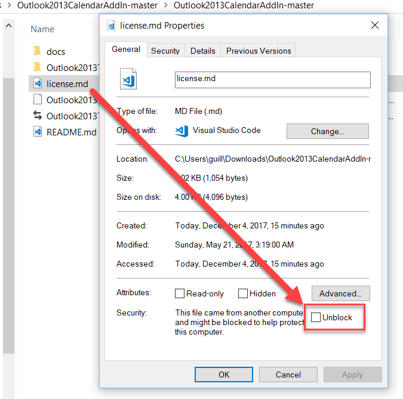
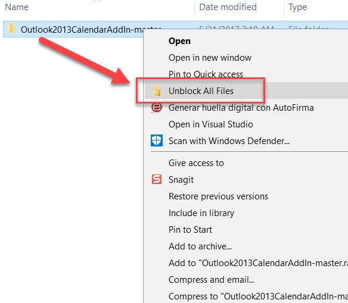

# Unblock All Files

When you download files from the Internet using Windows 10 sometimes they will be blocked due to the **SmartScreen** feature.

If you want to unblock a file you need to right-click the name, open the properties pane, then choose **unblock** and hit *O*K or *apply*:

The problem comes when you download a bunch of files and need to unblock them all. Or maybe you downloaded a ZIP file and forgot to unblock before unzipping. Granted you can disable the blocking behavior entirely but maybe you don't want to do that...

Now, there are powershell scripts to do this, but you have to open a console and type a couple of commands, so this little registry hack is for all the lazy people out there like me that want just a right-click integration thing with Windows Explorer.

You basically select the parent folder where you want all children to be unblocked (recursively) and... that's it! :-D

This is what it looks like:

You can download the .reg file and double-click it to install on your machine.

Hope you guys like it!